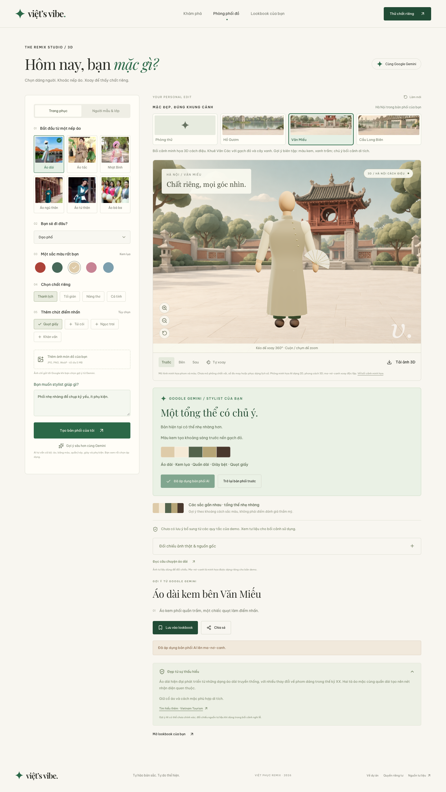

# Viets Vibe

> **Nếp xưa. Chất mới.**

Viets Vibe là một trải nghiệm khám phá và phối Việt phục dành cho thế hệ trẻ. Người dùng có thể tìm hiểu câu chuyện phía sau từng trang phục, tự tạo bản phối trong studio 3D, nhận gợi ý từ Gemini và lưu lại lookbook cá nhân.



## Vì sao Viets Vibe?

Việt phục thường khó tiếp cận khi thông tin bị tách rời khỏi trải nghiệm mặc. Ứng dụng kết nối bốn bước trong một luồng liền mạch:

**Khám phá → Hiểu bối cảnh → Thử phối → Lưu và chia sẻ**

Đây là một proof of concept tập trung vào giáo dục văn hóa và sáng tạo cá nhân. Ứng dụng không phải công cụ thử đồ bằng ảnh, không dự đoán độ vừa vặn và không thay thế tư vấn từ chuyên gia văn hóa.

## Điểm nổi bật

### Thư viện Việt phục

- Sáu nhóm trang phục: áo dài, áo tấc, Nhật Bình, áo ngũ thân, áo tứ thân và áo bà ba.
- Tìm kiếm không dấu, lọc theo vùng và trang chi tiết theo từng loại áo.
- Thông tin nhận diện, dịp sử dụng, bối cảnh văn hóa, nguồn tư liệu và ghi công hình ảnh.

### Studio phối đồ 3D

- Ma-nơ-canh Three.js xoay 360 độ với góc trước, bên và sau.
- Tùy chỉnh dáng, chiều cao minh họa, sắc da, màu từng lớp, giày và phụ kiện.
- Mẫu nam tóc ngắn rẽ ngôi, mẫu nữ tóc búi thấp; đầu và tóc giữ tỉ lệ khi đổi chiều cao.
- Bề mặt lụa, đũi và gấm có thớ dệt, nếp rủ minh họa.
- Nón lá 3D có vành tre và quai, lưu cùng bản phối.
- Giao diện Việt/Anh, bao gồm điều khiển studio và lời tư vấn theo ngôn ngữ đang chọn.
- Zoom, tự xoay, tải ảnh PNG và xem gợi ý phối màu có giải thích.

### Stylist AI

- Gợi ý cách phối, nhận xét tổng thể và lưu ý văn hóa theo lựa chọn của người dùng.
- Có thể gửi ảnh JPG, PNG hoặc WebP tối đa 5 MB để nhận tư vấn sâu hơn.
- Nút phối lại cùng Gemini có thể áp dụng bản phối hợp lệ lên người mẫu, kèm bảng thay đổi và hoàn tác.
- API key chỉ được đọc ở server, không đưa vào URL hay bundle phía trình duyệt.
- Khi chưa cấu hình Gemini, thư viện và studio cơ bản vẫn hoạt động với dữ liệu cục bộ.

### Lookbook và bối cảnh

- Lưu tối đa 30 bản phối trên trình duyệt bằng `localStorage`.
- Tiếp tục chỉnh sửa, so sánh, xóa, hoàn tác và xuất/nhập bản sao JSON.
- Chọn bối cảnh minh họa Hồ Gươm, Văn Miếu hoặc cầu Long Biên.
- Ảnh xuất và lookbook giữ lại bối cảnh đã chọn; đây là ảnh nền minh họa, không phải cảnh 3D hay ảnh tư liệu.

## Chạy nhanh

### Yêu cầu

- Node.js 22 LTS
- npm
- Kết nối mạng khi cài dependency hoặc build lần đầu để tải Google Fonts

### Cài đặt

```bash
cd viets-vibe
npm ci
cp .env.example .env.local
npm run dev
```

Mở [http://localhost:3000](http://localhost:3000). Nếu chưa có API key, bạn vẫn dùng được thư viện, studio cơ bản và lookbook.

## Cấu hình Gemini

Mở `viets-vibe/.env.local` và điền key từ [Google AI Studio](https://aistudio.google.com/apikey):

```env
GEMINI_API_KEY=your_google_ai_studio_key
GEMINI_MODEL=gemini-flash-latest
GEMINI_FALLBACK_MODEL=gemini-flash-lite-latest
```

Sau khi thay đổi biến môi trường, khởi động lại server. Không dùng tiền tố `NEXT_PUBLIC_` cho key và tuyệt đối không commit `.env.local`.

`GEMINI_MODEL` có thể đổi sang model khác được Google project hỗ trợ. Xem danh sách tại [Gemini API documentation](https://ai.google.dev/gemini-api/docs/models).

## Scripts

Chạy các lệnh bên dưới từ thư mục `viets-vibe`:

| Lệnh                    | Mục đích                                  |
| ----------------------- | ----------------------------------------- |
| `npm run dev`           | Chạy server phát triển                    |
| `npm run build`         | Tạo production build                      |
| `npm run start`         | Chạy production server                    |
| `npm run check`         | ESLint, TypeScript và kiểm tra nội dung   |
| `npm run test:e2e`      | Chạy kiểm thử end-to-end bằng Playwright  |
| `npm run format`        | Format source, test và tài liệu           |
| `npm run format:check`  | Kiểm tra format mà không ghi file         |
| `npm run check:content` | Kiểm tra dữ liệu trang phục, nguồn và ảnh |

E2E test dùng Chrome có sẵn trên macOS. Trên máy khác, cài browser bằng `npx playwright install chromium` hoặc cấu hình `PLAYWRIGHT_CHROME_PATH`. Kiểm thử Gemini dùng phản hồi giả lập và không gọi Google thật.

## Cấu trúc dự án

```text
viets-vibe/
├── app/                    Giao diện, route và API của Next.js
│   ├── heritage/           Thư viện và trang chi tiết Việt phục
│   ├── mix-match/          Studio phối đồ
│   ├── lookbook/           Bộ sưu tập cá nhân
│   ├── api/style/          API tư vấn Gemini phía server
│   ├── components/         Header, avatar và công cụ dùng chung
│   └── lib/                Dữ liệu, avatar, stylist và localStorage
├── public/images/          Ảnh trang phục và bối cảnh cục bộ
├── docs/                   Tài liệu kiến trúc, demo, triển khai và kiểm thử
├── tests/                  Kiểm thử end-to-end
└── scripts/                Script audit nội dung
```

## Tài liệu

- [Demo và pitch](viets-vibe/docs/DEMO.md): kịch bản trình bày, Q&A và tiêu chí audition.
- [Kiến trúc](viets-vibe/docs/ARCHITECTURE.md): luồng dữ liệu, API, lưu trữ và giới hạn.
- [Triển khai](viets-vibe/docs/DEPLOYMENT.md): Node server, Docker, biến môi trường và vận hành.
- [Nội dung và hình ảnh](viets-vibe/docs/CONTENT.md): nguồn, ghi công và cách thêm trang phục.
- [Kiểm thử](viets-vibe/docs/TESTING.md): test tự động và checklist kiểm tra thủ công.
- [Bối cảnh minh họa](viets-vibe/docs/BACKDROP-PROMPTS.md): nguồn và prompt tạo bối cảnh.
- [Roadmap](viets-vibe/docs/ROADMAP.md): phạm vi hiện tại và hướng phát triển tiếp theo.
- [Changelog](viets-vibe/CHANGELOG.md): các thay đổi chính theo phiên bản.

## Dữ liệu, quyền sử dụng và giới hạn

Lookbook chỉ lưu trong trình duyệt, không có tài khoản, đồng bộ server, thanh toán hoặc cơ sở dữ liệu người dùng. Hãy xuất bản sao trước khi xóa dữ liệu trình duyệt.

Nội dung hiện tại giới thiệu một số trang phục của người Việt, chủ yếu trong bối cảnh Kinh, và không đại diện cho mọi dân tộc hay vùng văn hóa. Nguồn lịch sử được tách khỏi ảnh thực hành đương đại. Ghi công không thay thế giấy phép; cần xác nhận quyền sử dụng trước khi phát hành công khai.

## Công nghệ

Next.js 16 App Router · React 19 · TypeScript · Three.js · Framer Motion · Lucide · Tailwind CSS 4 · Google Gen AI SDK · Playwright

## Đóng góp

Giữ thay đổi nhỏ và có mục đích rõ ràng. Trước khi mở pull request, chạy:

```bash
cd viets-vibe
npm run check
npm run format:check
```

Khi thay đổi luồng người dùng, cập nhật test E2E và tài liệu liên quan trong cùng pull request.
