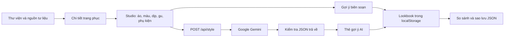

# Kiến trúc

## Luồng trải nghiệm



## Ranh giới client/server

Trang chi tiết Việt phục được dựng tĩnh từ `app/lib/heritage.ts`. Tìm kiếm, lọc, tùy chỉnh và localStorage chạy trong trình duyệt. API key chỉ đọc ở `app/api/style/route.ts`; client gọi endpoint cùng origin.

Ảnh tải lên được preview bằng object URL, giải phóng khi thay ảnh hoặc rời trang. Khi người dùng yêu cầu Gemini, FileReader mã hóa ảnh để gửi qua server. Ứng dụng không lưu ảnh lên đĩa hoặc database. Google và hạ tầng hosting có chính sách dữ liệu riêng.

## Hợp đồng API

`POST /api/style`, `Content-Type: application/json`:

```json
{
  "occasion": "Tết",
  "garment": "Áo ngũ thân",
  "color": "Ngọc bích",
  "vibe": "Thanh lịch",
  "accessories": ["Quạt giấy"],
  "imageDescription": "Một bản phối cho ngày Tết"
}
```

Có thể thêm `imageBase64` và `mimeType` (`image/jpeg`, `image/png`, `image/webp`). Không gửi ảnh nếu không có nhu cầu. Không dùng dữ liệu nhạy cảm trong mô tả.

Response 200:

```json
{
  "suggestion": {
    "tên_trang_phục": "Áo ngũ thân xanh ngọc",
    "nguồn_gốc": "Tóm tắt tham khảo",
    "gợi_ý_phối": ["Một gợi ý cụ thể"],
    "cảnh_báo_văn_hóa": "Lưu ý theo bối cảnh"
  }
}
```

Lỗi trả `{ "error": "Thông báo tiếng Việt" }`: 400 dữ liệu không hợp lệ, 413 ảnh quá lớn, 415 định dạng ảnh không hỗ trợ, 503 thiếu key; lỗi nhà cung cấp hiện được gom thành 500. Không trả API key hoặc lỗi nội bộ trực tiếp cho client. Server kiểm tra schema phản hồi trước khi trả về.

## Dữ liệu văn hóa

`collection` chứa mô tả và nguồn tư liệu; `details` chứa nhận diện, dịp mặc, gợi ý biên soạn và nguồn ảnh. Ghép theo ID thành `garments`. ID phải ổn định vì được dùng trong URL và bản lưu. Vùng miền là cách tổ chức thư viện, không có nghĩa trang phục chỉ được dùng trong vùng đó.

## Lookbook

Key: `viets-vibe-lookbook-v1`. Tối đa 30 phần tử `SavedLook`. Dữ liệu đọc qua kiểm tra kiểu và các danh mục cho phép. React `useSyncExternalStore` cập nhật giao diện khi storage thay đổi. Bản sao JSON có `version: 1`, nhập không ghi đè ID trùng và từ chối dữ liệu không hợp lệ.

URL chia sẻ chứa lựa chọn, không chứa ảnh và nguyên văn lời gợi ý. Vì vậy liên kết dùng để dựng lại ý tưởng phối, không phải bản chụp cố định của phản hồi AI.

## Giới hạn vận hành

Không có user account, database, rate limiter dùng chung hoặc phân quyền. Trước khi mở public với key trả phí, bổ sung giới hạn request ở gateway và ngân sách Google project. Đánh giá độ đúng văn hóa bằng kiểm thử nội dung và người biên tập, không chỉ dựa vào schema hoặc test UI.

## Canvas 3D và cấu hình bản phối

`components/avatar-canvas.tsx` được tải động, không SSR. Three.js dựng cảnh WebGL, OrbitControls hỗ trợ xoay/zoom. `lib/mannequin.ts` tạo hình học theo từng loại áo: thân, tà, cổ, tay áo, lớp trong, quần/váy, giày và phụ kiện. Tài nguyên GPU được dispose khi đổi model hoặc rời trang. Renderer giới hạn pixel ratio, chỉ vẽ lại khi cảnh/camera thay đổi; tự xoay mặc định tắt. Thiết bị không có WebGL nhận thông báo và vẫn dùng được studio cơ bản.

`lib/avatar.ts` định nghĩa, kiểm tra và khôi phục cấu hình. URL chia sẻ chứa JSON cấu hình đã kiểm tra. Lookbook v1 giữ tương thích với bản lưu cũ, bổ sung `avatar` và thumbnail JPEG của mô hình. PNG xuất tại góc camera hiện tại có nhãn minh họa. Ảnh người dùng tải lên không được dùng làm texture, không nằm trong thumbnail.

Các rule văn hóa bao phủ: giản lược cổ áo, áo tứ thân phối quần, sneaker ở bối cảnh dự lễ và diễn giải phẩm cấp Nhật Bình. Đây là lưu ý biên tập có nguồn theo trang phục, không phải bộ phân loại đúng/sai hay kết luận đã được chuyên gia chứng nhận. Hàm màu dùng khoảng cách hue, bỏ qua sắc gần trung tính; không đánh giá chất liệu, ánh sáng hoặc sở thích cá nhân.

Mô hình là geometry minh họa tự dựng, chưa có cloth simulation, đo size chính xác hoặc asset phục dựng. Dáng trình bày không giới hạn quyền chọn trang phục. Cần thay/nâng cấp mesh bằng tài sản 3D có quyền sử dụng và chuyên gia duyệt để tiến tới sản phẩm thử đồ thực tế.

Tài liệu renderer và điều khiển: [Three.js WebGLRenderer](https://threejs.org/docs/pages/WebGLRenderer.html), [OrbitControls](https://threejs.org/docs/pages/OrbitControls.html).
